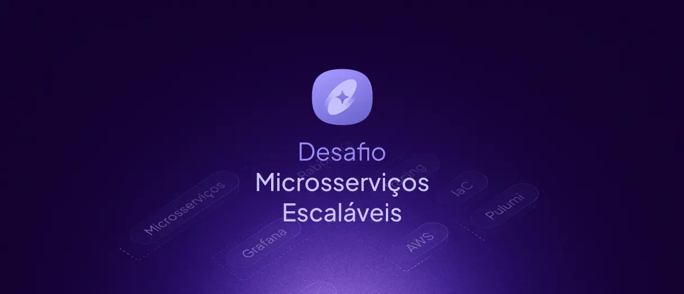

# Desafio Microsservicos Nodejs

Este projeto consiste em uma arquitetura de microsserviços desenvolvida com Node.js e TypeScript, focada em alta disponibilidade, escalabilidade e observabilidade. A solução é composta por dois microsserviços independentes que se comunicam através de mensageria, com infraestrutura gerenciada como código (IaC) e ferramentas completas de monitoramento.



## Arquitetura
### Componentes Principais
- **Microsserviços**:
    - : Gerencia todo o ciclo de pedidos **app-orders**
    - : Responsável por geração e gerenciamento de faturas **app-invoices**

- **Infraestrutura**:
    - **Kong**: API Gateway para roteamento e controle de acesso
    - **RabbitMQ**: Mensageria para comunicação assíncrona entre serviços
    - **PostgreSQL**: Banco de dados relacional dedicado para cada microsserviço
    - **Pulumi**: IaC (Infraestrutura como Código) para provisionamento em nuvem
    - **Docker**: Containerização para desenvolvimento e produção

- **Observabilidade**:
    - **Jaeger**: Rastreamento distribuído em ambiente de desenvolvimento
    - **Grafana**: Monitoramento e visualização de métricas em produção
    - **OpenTelemetry**: Instrumentação para coleta de telemetria

## Stack Tecnológica
- **Backend**: Node.js com TypeScript
- **Frameworks**: Fastify para APIs HTTP de alto desempenho
- **Banco de Dados**: PostgreSQL com ORM Drizzle
- **Validação**: Zod para validação de dados e tipagem
- **Mensageria**: RabbitMQ com amqplib
- **IaC**: Pulumi com AWS SDK
- **Containerização**: Docker
- **Qualidade de Código**: Biome para linting e formatação

## Como Executar
### Requisitos
- Docker e Docker Compose
- Node.js 22.x
- PNPM

### Ambiente de Desenvolvimento
1. Clone o repositório:
``` bash
   git clone https://github.com/Luiz1nn/desafio-microsservicos-nodejs.git
   cd desafio-microsservicos-nodejs
```
1. Inicie os serviços com Docker Compose:
``` bash
   docker-compose up -d
```
1. Configure as variáveis de ambiente:
``` bash
   cp app-orders/.env.example app-orders/.env
   cp app-invoices/.env.example app-invoices/.env
```
1. Instale as dependências e inicie os serviços:
``` bash
   # Para o serviço de pedidos
   cd app-orders
   pnpm install
   pnpm dev
   
   # Para o serviço de faturas
   cd app-invoices
   pnpm install
   pnpm dev
```
## Infraestrutura como Código
O projeto utiliza Pulumi para gerenciamento de infraestrutura AWS:
``` bash
cd infra
pnpm install
pulumi up
```

## Estrutura do Projeto
``` 
.
├── app-orders/           # Microsserviço de pedidos
├── app-invoices/         # Microsserviço de faturas
├── contracts/            # Contratos compartilhados entre serviços
├── docker/               # Configurações Docker comuns
├── infra/                # Código Pulumi para IaC
└── docker-compose.yml    # Composição dos serviços para desenvolvimento
```
## Fluxo de Comunicação
1. Requisições externas são roteadas através do Kong API Gateway
2. O serviço processa pedidos e publica eventos no RabbitMQ `app-orders`
3. O serviço consome esses eventos e gera faturas `app-invoices`
4. Toda a telemetria é capturada via OpenTelemetry e visualizada no Jaeger/Grafana
